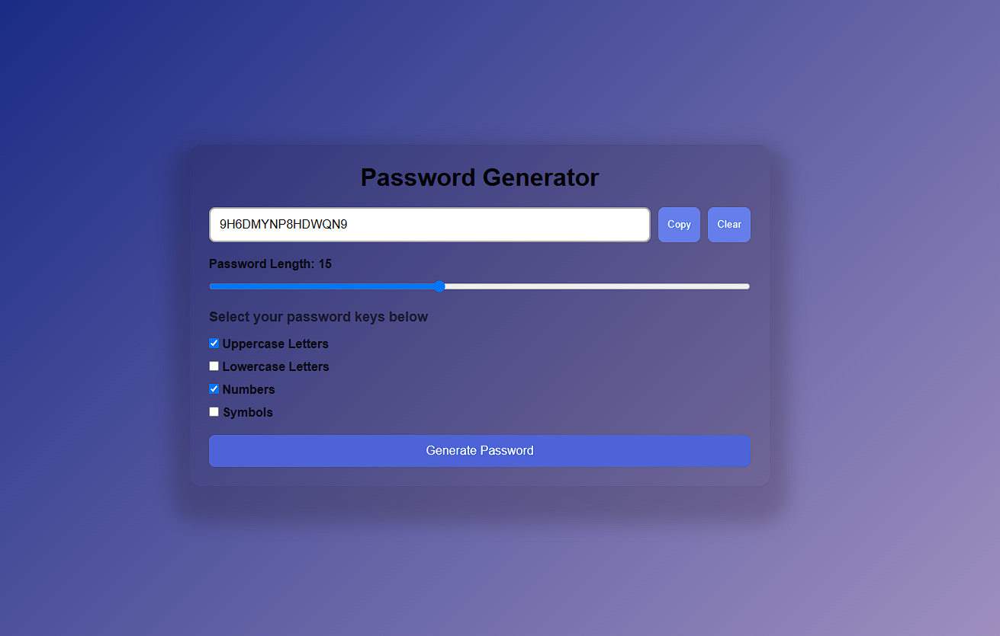

# Password Generator

A simple and responsive Password Generator built with **HTML, CSS, and JavaScript**. Generate strong and secure passwords with customizable options and copy them to your clipboard instantly.

---

## Features

- Generate random secure passwords
- Adjustable password length
- Include Uppercase Letters (A-Z)
- Include Lowercase Letters (a-z)
- Include Numbers (0-9)
- Include Symbols (!@#$%^&*)
- Copy password to clipboard
- Clear generated password
- Responsive and modern UI

---

## Technologies Used

- HTML5
- CSS3
- JavaScript (ES6)

---

## Project Structure

```text
password-generator/
│
├── index.html
├── style.css
├── app.js
└── README.md
```

---

## Getting Started

### Clone the Repository

```bash
git clone https://github.com/your-username/password-generator.git
```

### Navigate to the Project Folder

```bash
cd password-generator
```

### Run the Project

Simply open `index.html` in your browser.

---

## 📸 Screenshots

### Main Interface



---

## Future Enhancements

- Password Strength Indicator
- Dark/Light Theme Toggle
- Password History
- Save Favorite Passwords
- Exclude Similar Characters (O, 0, l, I)

---


